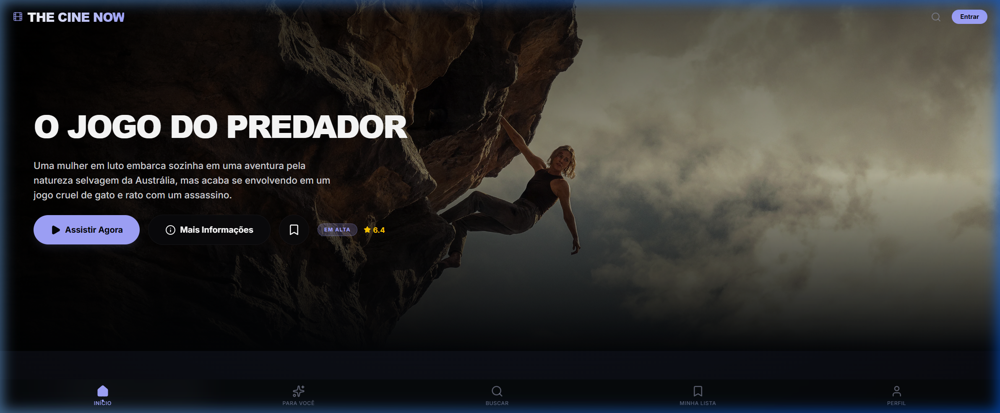

<div align="center">
  
  
  # 🎬 The Cine Now
  ### Premium Cinema Hub & AI-Powered Recommendations
  
  [](https://thecinenow.vercel.app/)
  [](https://react.dev/)
  [](https://tailwindcss.com/)
  [](https://firebase.google.com/)
  [](https://ai.google.dev/)
</div>

---

## 🌟 Visão Geral

**The Cine Now** é uma plataforma de cinema premium projetada para oferecer uma experiência imersiva e personalizada. Utilizando inteligência artificial de ponta (Google Gemini), a aplicação não apenas lista filmes, mas entende o gosto do usuário para oferecer recomendações precisas e contextuais.

## ✨ Principais Funcionalidades

- 🤖 **AI Recommendations**: Sistema inteligente que utiliza o Google Gemini para sugerir filmes com base no seu perfil.
- 🔐 **Premium Auth**: Sistema de autenticação seguro via Firebase (Login/Registro).
- 📱 **Experiência Multiplataforma**: Totalmente responsivo para Web e preparado para Android via Capacitor.
- 🎬 **Trailer Integration**: Assista aos trailers diretamente na plataforma.
- 🌗 **Premium UI/UX**: Interface moderna com animações fluidas via Framer Motion e design em modo escuro elegante.
- 🌍 **Internacionalização**: Suporte a múltiplos idiomas para uma audiência global.

## 🛠️ Tech Stack

### Core
- **Framework**: [React 19](https://react.dev/)
- **Build Tool**: [Vite](https://vitejs.dev/)
- **Styling**: [Tailwind CSS 4.0](https://tailwindcss.com/)
- **Animations**: [Motion](https://motion.dev/)

### Backend & AI
- **Authentication/Database**: [Firebase](https://firebase.google.com/)
- **AI Engine**: [Google Generative AI (Gemini)](https://ai.google.dev/)

### Mobile Support
- **Android**: [Capacitor](https://capacitorjs.com/)
- **Hybrid**: [Expo](https://expo.dev/)

---

## 🚀 Como Rodar o Projeto

### Pré-requisitos
- Node.js instalado
- Uma chave de API do Google Gemini

### Passo a Passo

1. **Clone o repositório:**
   ```bash
   git clone https://github.com/Gildeanderson/the-cine-now.git
   cd the-cine-now
   ```

2. **Instale as dependências:**
   ```bash
   npm install
   ```

3. **Configure as variáveis de ambiente:**
   Crie um arquivo `.env` na raiz e adicione suas credenciais:
   ```env
   VITE_GEMINI_API_KEY=sua_chave_aqui
   VITE_FIREBASE_API_KEY=sua_chave_aqui
   # ... outras variáveis do Firebase
   ```

4. **Inicie o servidor de desenvolvimento:**
   ```bash
   npm run dev
   ```

---

## 📱 Suporte Mobile

Para rodar a versão Android via Capacitor:
```bash
npm run cap:run:android
```

Para a versão Expo:
```bash
npm run mobile:start
```

---

<div align="center">
  <p>Desenvolvido com ❤️ por <strong>Gildeanderson Nascimento</strong></p>
  <p>
    <a href="https://github.com/Gildeanderson">
      
    </a>
  </p>
</div>
